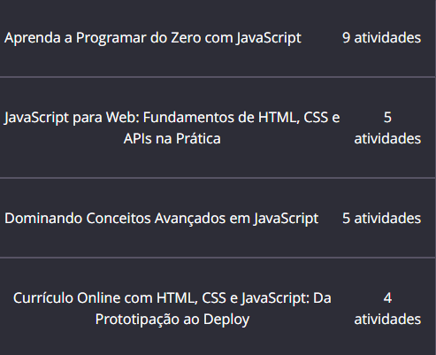

<html >
    <head>
        <link rel="stylesheet" href="styles.css">    
    </head>
<body>
    <main>
        

            <ul>
            <li></li> 
            <li><h1>Formação JavaScript Developer</h1></li> 
            </ul>
        

<h2>Estudante : Sidemar Schimmelpfennig Junior</h2>
<h2>Nivel : Intermediario</h2> 

Aprenda JavaScript do zero, em uma abordagem de ensino totalmente imersiva e prática. Nesta formação você aprenderá desde os fundamentos desta linguagem de programação até o seu papel essencial na Web atualmente. Para isso, traremos uma dinâmica diferente de tudo o que você já viu, onde o expert conduz todo o primeiro módulo usando a técnica de "pair programming", ensinando o JavaScript do zero para um profissional em transição de carreira.

Nos dois módulos seguintes, você dominará os conceitos necessários para utilizar o JavaScript na Web, com ênfase no consumo de APIs, convenções e boas práticas. Por fim, para fechar a sua jornada com chave de ouro, você criará seu próprio currículo online com a identidade visual da DIO. Pré-requisitos: Nenhuma, mas Lógica de Programação e Pensamento Computacional são sempre bem-vindos. Boooora!? 👩‍💻👨‍💻

Acesse o site da Digital Inovattion One :

Segue Abaixo os 4 Modulos do curso:

</main>
</body>
</html>